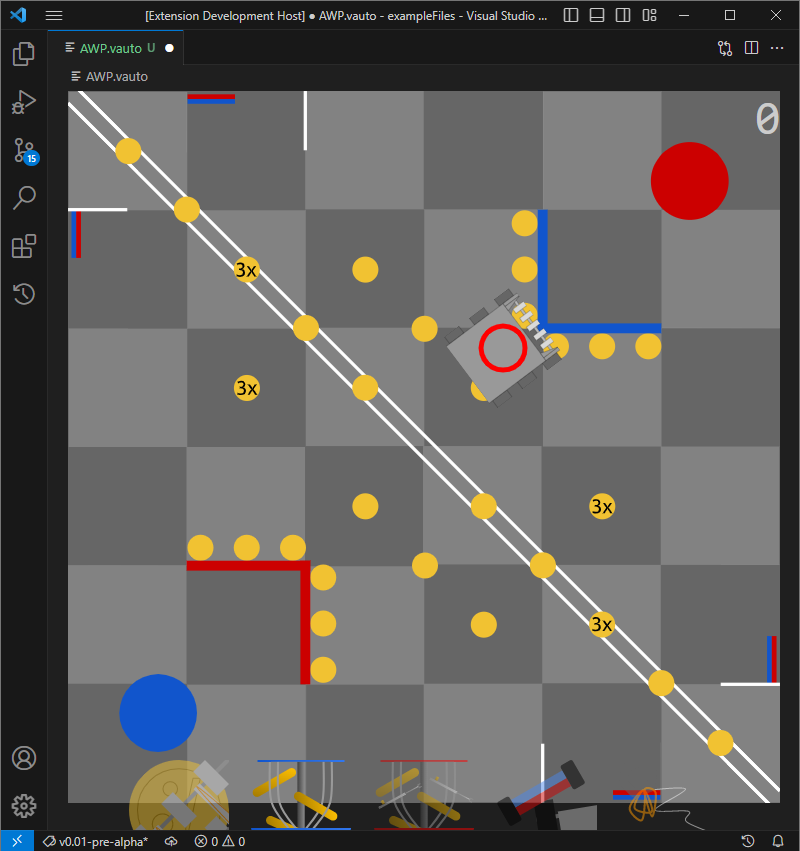

# Auton Builder for Vex Robotics Competition
A graphical editor for vrc autons.

## What it does
This extension allows programmers to easily create and modify autons in the form of a .vauton (json) file. This file can then be downloaded onto an Micro SD card and interpreted by the program on the robot.

> _**Note:**_ This extension does not handle how the auton will be performed, it only provides the information that comprises the auton.
## Use
- Interface
  - Robot - Represents state of the robot at the current auton node
    - Margin of error (red circle) - indicates the range robot will try to get to before moving onto the next node
  - Field - VRC Spin Up Field
  - Action Bar - Represents actions that robot will perform at the current auton node
    - Intake
    - Shoot
    - Piston Shoot
    - Roller
    - Expand
  - Node Index - shows index of current node (top right)
- Controls
  - Movement
    - Left Click & Drag - Move the robot around
    - Arrow Keys / WASD - Move the robot around 
    - Left Click + Alt - Rotate robot towards mouse pointer
    - R - Rotate robot 90 degrees (can be modified with shift)
    - C - Rotate robot to a heading of 0
  - Margin Of Error
    - Left Click & Drag - Modify margin of error
  - Node Management
    - J - Go to previous node
    - L - Go to next node
    - N - Create new node after this node
    - Delete - remove current note
  > _**Note:**_ Keybindings cannot be modified
## Installation 
1. Go To the desired release ([0.0.2-pre-alpha](https://github.com/meisZWFLZ/AutonGUI/releases/tag/v0.0.2-pre-alpha)) and download the .vsix file
2. Install using any of the below methods  
   - Open the folder containing the .vsix file in VS Code. Then right click on the .vsix and select `Install Extension VSIX`.
   - In VS Code run the `Extensions: Install from VSIX...` command.
   - In a terminal, run the following command  
      `code --install-extension /path/to/file/vrc-auton-0.0.1.vsix`
## Auton Data Structure
The .vauton file that this extension creates is just a .json file. This json is an array of auton nodes each containing an position value and an array of actions
- Auton Node
  - `"position": Position & HasMarginOfError` - Represents the position the robot will go to. 
    - `"x": number` - x coordinate in inches, 0 to 144. 0 being closest to the blue driver station and 144 being closest to the red driver station.
    - `"y": number` - y coordinate in inches, 0 to 144. 0 being closest to the audience and 144 being closest to the referees.
    - `"heading": number` - heading in degrees, 0 to 360. 0 being facing towards the audience and 90 facing the red driver station
    - `"marginOfError": number` - margin of error in inches, positive float. Acceptable distance from target point for robot to go onto the next node.
  - `"actions": ACTION[]` - unique array of enumerators representing the actions to be performed when the robot reaches `position`.
    - `ACTION.SHOOT = 0`  
    - `ACTION.PISTON_SHOOT = 1` 
    - `ACTION.INTAKE = 2` 
    - `ACTION.ROLLER = 3` 
    - `ACTION.EXPAND = 4` 
## Known Bugs
- Creating an empty .vauton file doesn't work  
  - Fix: copy an existing, working .vauton file and rename it