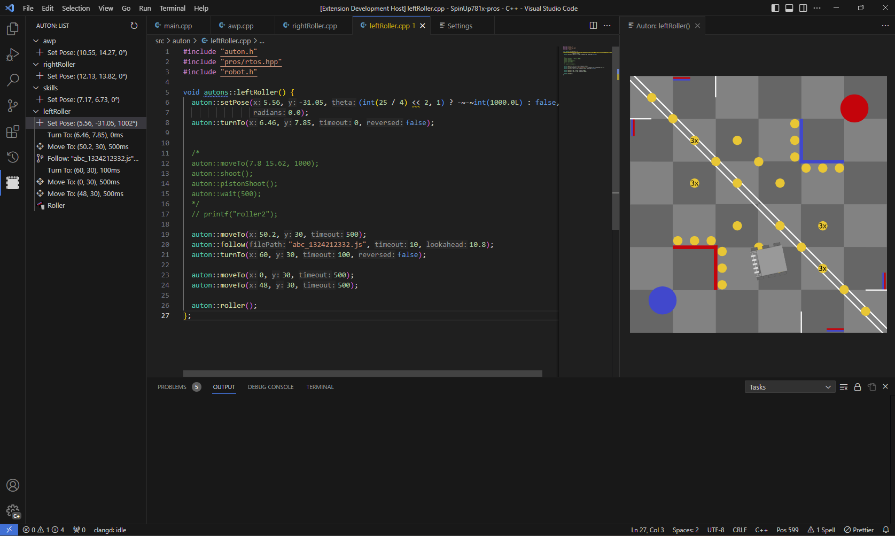

# Auton Builder for Vex Robotics Competition

A graphical aid for creating for vrc autons as a vscode extension.

## What it does

This extension provides a visualization of an auton written in cpp (and maybe a graphical way to edit it).


### Understood Actions:
Many of these are lemlib `chassis::*()` methods
- SetPose(x, y, theta, radians)
- MoveTo(x, y, timeout, maxSpeed, log)
- TurnTo(x,y, timeout, reversed, maxSpeed, log)
- Follow(filePath, timeout, lookahead, reverse, maxSpeed, log)†
- Wait(milliseconds)†
- Intake†
- StopIntake†
- Shoot†
- PistonShoot†
- Roller†
- Expand†

--- 
† *This is partially implemented, meaning that the list view understands it, but the webview does not understand it*

## How it works

This extension makes use of the [vscode clangd extension](https://marketplace.visualstudio.com/items?itemName=llvm-vs-code-extensions.vscode-clangd) to provide AST information 
(This is not yet implemented natively by this extension and instead requires a [modified version](https://github.com/meisZWFLZ/vscode-clangd-expose-ast) of it)

This AST is then translated into ["Actions"](./src/common/action.ts), a list of which is represented by an [Auton](./src/common/auton.ts).

This auton is then displayed as a list view in the activity bar. This list view can be used to select an action from the list to be displayed in the auton preview. (The list view might also be used to change the order of the actions)

The auton/action preview shows the user what an action does to the robot, by displaying the robot's position on the field (and perhaps modifying the look of the robot). (This might also be used to modify the cpp and maybe display motion from one action to another)

## What's missing
- All of the above is implemented, except for the parenthesized statements
- Configure displayed field (for different games and for skills vs matchplay)
- Configure robot dimensions
- Adding custom actions
- Deep Scanning functions, eg:
  ```cpp
  void turnTowardGoal() {
    auton::turnTo(64,64,1500);
  }
  void autons::shootIntoGoal() {
    turnTowardGoal(); // look into this function and find turnTo()
    auton::shoot();
  }
- Configure auton and autons namespaces
- Native lemlib `follow()` viewing
- Display partially understood actions in webview 
- Update actions to be similar to new lemlib version
- Expose AST API in clangd 

## Installation
Visit [CONTRIBUTING.md](CONTRIBUTING.md) for installation instructions

## Contributing
Any contributions you'd like to make would be greatly appreciated and instructions on how to do so are present in [CONTRIBUTING.md](CONTRIBUTING.md)